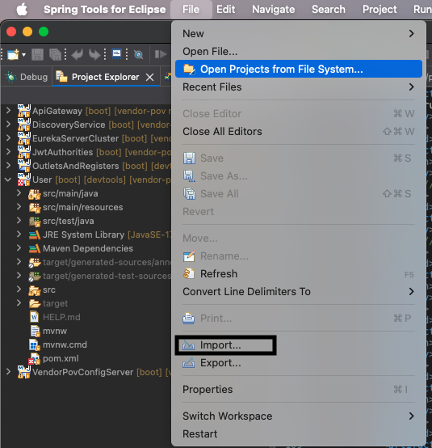
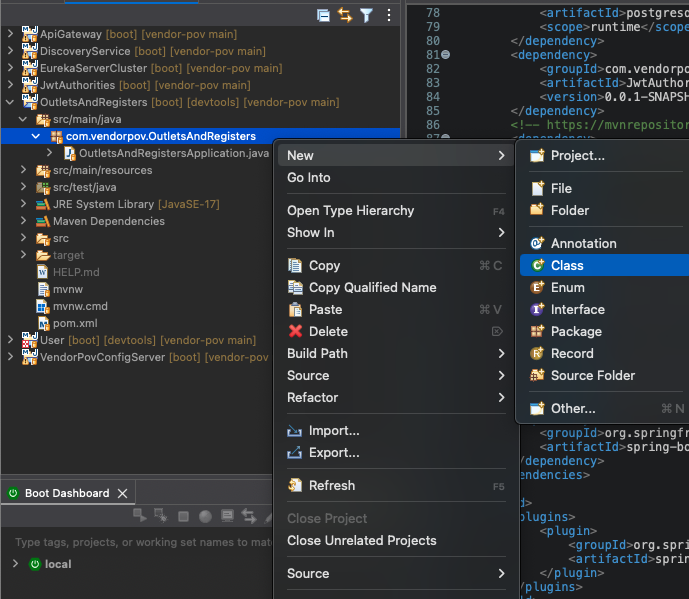
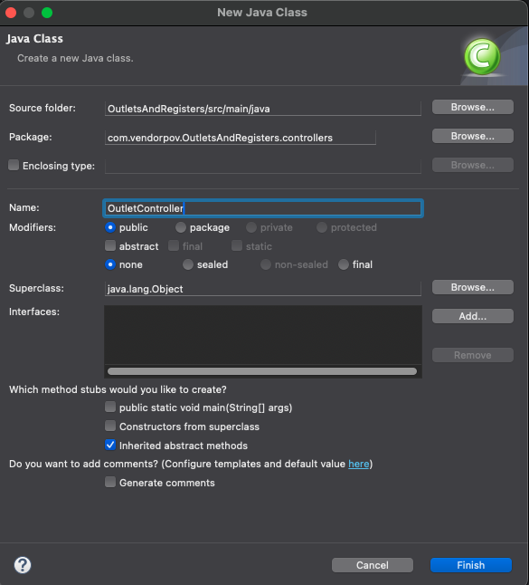
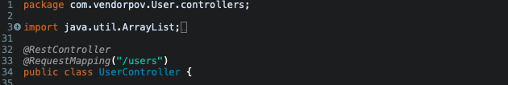
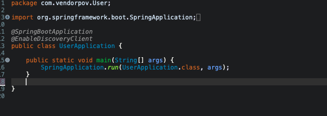

# Setup a new microservice

## Create a Microservice
* Create a project
1. Go to https://start.spring.io/

2. Specify project configuration
Project type - Maven
Language - Java
Spring Boot version - 4.0.0
Project Metadata:
Group - com.vendorpov
Artifact - <name of microservice>
Name - <same as artifact>
Description (Optional)
Packaging - JAR
Configuration - Properties
Java version - 17

3. Add dependencies
Spring Web - for building APIs
Spring Boot Devtools - for hot reload
Validation - for validating request payloads

4. Click on Generate to download Project


5. Move downloaded project from step 4 to local copy of repository

6. Import the project in STS
1. Navigate to File > Import



2. Click on Existing Maven Projects, then click Next

3. Specify Root Directory of repository by clicking on Browse

4. Tick the checkbox of the project you want to import


* Add Controller
1. Right click on under "src/main/java" and add new class



2. Set a name for the class (e.g. UserController) and save it under controllers package



3. Annotate the class with @RestController and @RequestMapping



Notes:
@RestController enables the project of:
- Handling HTTP requests (GET, POST, PUT, DELETE).
- Returning Java objects as JSON/XML without extra configuration.
- Acting as an endpoint for client-server communication.

@RequestMapping - maps incoming HTTP requests to controller methods.
- When @RequestMapping is defined in the class level, it will be applied to all methods within the class. Otherwise, if @RequestMapping is defined in a specific method, then it will only be applied to that method.

4. Setup a simple GET method

```
package com.vendorpov.Products.controllers;

import org.springframework.web.bind.annotation.GetMapping;
import org.springframework.web.bind.annotation.RequestMapping;
import org.springframework.web.bind.annotation.RestController;

@RestController
@RequestMapping("/products")
public class ProductController {
	
	@GetMapping
	public String getProducts() {
		return "Hello World";
	}

}
```

5. Start up service and try sending a request in Postman

6. Add a POST method to create resources

7. Update Get method

* Define Models
* Configure Service Layer
* Configure Data Layer
* Create Interactive Documentation with Swagger

## Configure microservice to work with ...
* Spring Cloud Eureka Server (Discovery Service)
1. Add dependency in pom.xml
```
    <dependency>
        <groupId>org.springframework.cloud</groupId>
        <artifactId>spring-cloud-starter-netflix-eureka-client</artifactId>
        <version>4.3.0</version>
    </dependency>
```

2. Annotate main method with @EnableDiscoveryClient


3. application.properties
```
    spring.application.name=users
    server.port=0
    eureka.client.service-url.defaultZone=http://localhost:8010/eureka
```

Notes:
- spring.application.name 

When your microservice starts up, it uses the value of spring.application.name to register itself with the Eureka Server. This is the name that other services will use to call this service. The service registry resolves the name to the actual host and port of a running instance.

- server.port 

By setting this property to 0, a dynamically allocated, random port is assigned to the Spring Boot microservice upon startup. This is a crucial to enable the deployment of multiple service instances (scaling horizontally) and prevents port conflicts. The Service Discovery mechanism (Eureka) will register each instance with its unique host and port combination, allowing a Load Balancer to distribute requests efficiently across the available instances.

- eureka.client.service-url.defaultZone 

This defines the address of the eureka server that the microservice need to connect to.

* API Gateway


* Spring Cloud Config Server

## Configure Role-based Access Control
* Enable Spring Security
* Add dependency to parse JWT
* Implement Authorization Filter
* Configure HTTP Security
* Add Spring Security Annotations
* CORS configuration
Add in controller class
'''
@CrossOrigin(origins=*)
'''
May have to add the following matcher in WebSecurityConfig as well
```
.requestMatchers(HttpMethod.OPTIONS, "/**").permitAll()
```