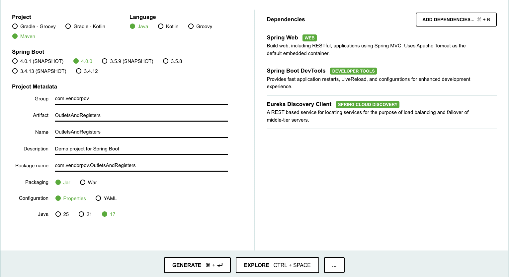

# Setup a new microservice

## Create a Microservice
* Create a project
1. Go to https://start.spring.io/

2. Specify project configuration
Project type - Maven
Language - Java
Spring Boot version - 4.0.0
Project Metadata:
Group - com.vendorpov
Artifact - <name of microservice>
Name - <same as artifact>
Description (Optional)
Packaging - JAR
Configuration - Properties
Java version - 17

3. Add dependencies
Spring Web - for building APIs
Spring Boot Devtools - for hot reload
Eureka Discovery Client - to connect to API Gateway

4. Click on Generate to download Project

* Add Controller
* Define Models
* Configure Service Layer
* Configure Data Layer
* Create Interactive Documentation with Swagger

## Configure microservice to work with ...
* Spring Cloud Config Server
* Spring Cloud Eureka Client
* API Gateway

## Configure Role-based Access Control
* Enable Spring Security
* Add dependency to parse JWT
* Implement Authorization Filter
* Configure HTTP Security
* Add Spring Security Annotations